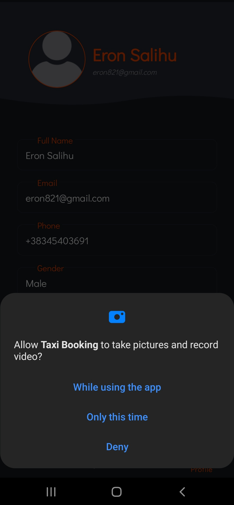
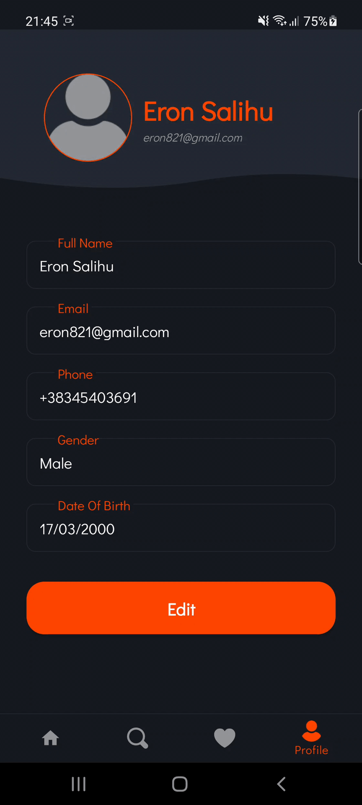

# Taxi Booking

You are ready to go out but, you need a taxi and you do not know if there is a one nearby. We bring you the Taxi Booking app.

Our app based on your location shows the number of taxis around you. It is managed by for menus that we thought it will fufills the requirements of our users.
The app shows you a various list of taxit with their details on it. You can call/text them.

## Technical project requirements

- [x] Activities
    + SplashScreenActivity
    + LogInActivity
    + RegisterActivity
    + MainActivity
    +	MapsActivity
   	+ ChangePasswordActivity
- [x] Fragments
		+ HomeFragment
    + ExploreFragment
    +  AddressFragment
    + ProfileFragment
    + FavoritesFragment
    + EditProfileFragment
    +  TaxiDetailsFragment
- [x] Android manifest permissions
    + ACCESS_FINE_LOCATION
   	+ ACCESS_COARSE_LOCATION
    +	INTERNET
    +	CAMERA
    +	READ_EXTERNAL_STORAGE
    +	CALL_PHONE
- [x]Linear Layout, Relative Layout and Constraint Layout 
-	[x] JSON data parse
     + ExploreFragment   
- [x]Threads  AsyncTask
    + LoadImageTask
- [x]Internal database
    +	Room (DAO)
- [x] Shared preferences 
    + SplashScreenActivity
- [x] Firebase integration 
    + Authentication
    + Realtime Database 
    + Storage 
- [x] Menu, Tabs
    + NavigationMenu
    + SideBarMenu
- [x] Toasts and Snackbars
- [x] Animation 
    + slide_right
    + slide_left
		 slide_up
- [x] Supports screen
    + Sw480dp
   	+ Sw600dp
   	+ Sw720dp
   	+ Landscape
- [x] Libraries(packages)
	  + Retrofit
		+ Jsoup
		+ Volley
		+ Hdodenhof etc.

Bonus:
- [x] Komunikimi me pjese harduerike te telefonit
    + android.hardware.camera
  	+ andorid.hardware.camera.autofocus
    + android.hardware.camera.flash
- [x] Map implementation  [ClusterMaps]

## Implementation of requirements

| |
| :---:|
| *Intro* |

|  |  |  |  | | 
| :---: | :---: | :---: | :---: | :---: |
 *Sign In* | *Sign In with Google*| *Sign Up* | *Email Verification* | *Change Password* |
  
--Users registration and log in is done by using Firebase tool, using Firebase Authentication the users can login/register in the app, the users profile data are saved in Firebase Database, whereas the users profile picture is saved in Firebase Storage.
  
| |  |
| :---: | :---: |
| *Home* | *Search on the map* | 

 Using Google Maps Api the app finds the user location. 

| |  | |
| :---: | :---: |:---: |
| *Explore* | *Detail list item* | *Call permission* | 

The list of taxis is a recyclerview that contains a list of json data object. The detail image of the item is done by using AsyncTask.

| |  | |
| :---: | :---: |:---: |
| *Saved* | *List of saved addresses* | *Adding new address* | 

Adding/saving addresses is done by implementing an internal database. We have choose to use a RoomDao db for our app.

| |  | | | |
| :---: | :---: |:---: |:---: |:---: |
| *Profile* | *Updating profile* | *Import image* | *Camera permission* | *Storage permission* | 

The user profile is saved in Firebase Database and profile image in Firebase Storage.
## Bonus

| |  | |
| :---: | :---: |:---: |
| *Cluster map* | *Clustered map* | *Hardware communication* |

## Demo

| |  | | |
| :---: | :---: |:---: |:---: |
| *Home* | *Explore* |*Saved* |*Profile* |
## Members

[Eron Salihu](https://github.com/eronsalihu) 
[Enis Berisha](https://github.com/enisbe1)
[Erisera Troshupa](https://github.com/erisera19)
